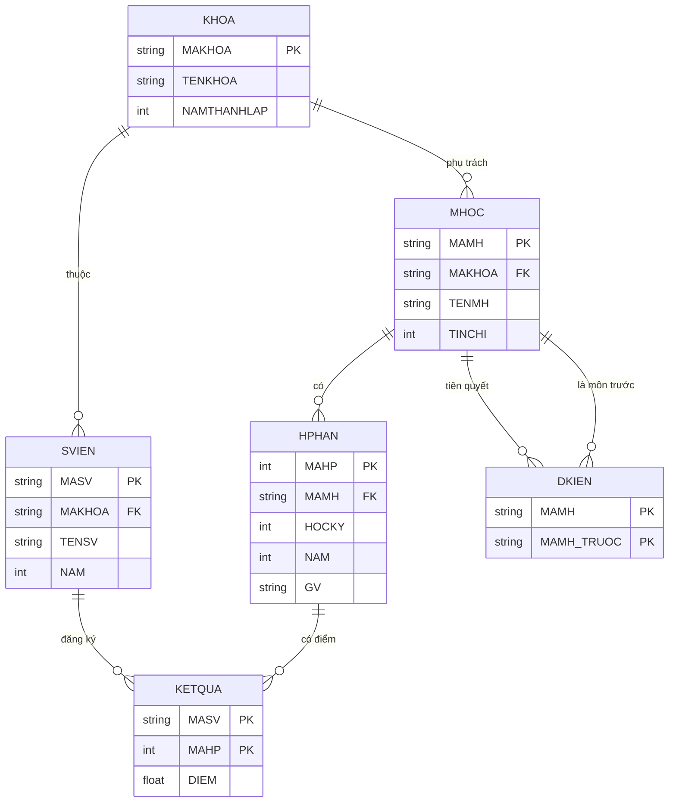
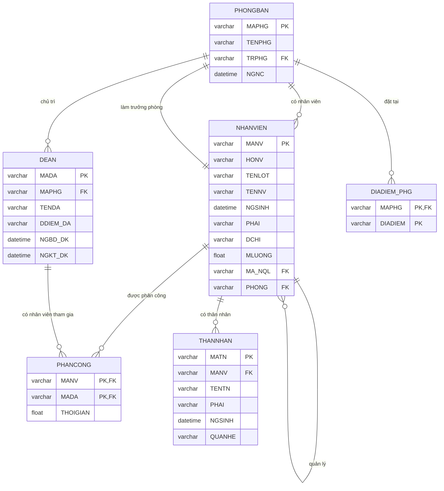
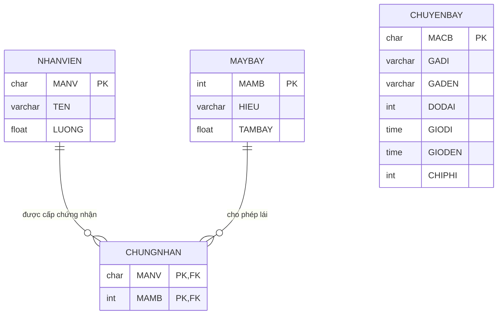

<div align="center">
  
</div>

<div align="center">
  
</div>

<br/>

---

### Tổng quan môn học

**SQL-SELF-STUDY** là kho lưu trữ các bài tập thực hành SQL của tôi trong quá trình tự học. Dự án bao gồm 3 lược đồ cơ sở dữ liệu khác nhau, với hơn 50 câu truy vấn từ cơ bản đến nâng cao, bao gồm cả Đại số quan hệ (Relational Algebra) và SQL thuần.

> "The only way to learn SQL is to write SQL – and then rewrite it better."

---

###  Cấu trúc 

| File | Mô tả | Số bảng |
| :--- | :--- | :--- |
| **Practice_SQL_2.sql** | **Quản lý Sinh viên** – Mô hình SV, Khoa, Môn học, Kết quả, Tiên quyết. |
| **SQL03.sql / SQLL_BT_01.sql** | **Quản lý Đề án** – Mô hình Nhân viên, Phòng ban, Đề án, Thân nhân, Phân công. |
| **BTLT03.sql** | **Quản lý Chuyến bay** – Mô hình Phi công, Máy bay, Chứng nhận, Chuyến bay. |
| **self_study_sql2.sql** | **Bài tập mở rộng** – Quản lý sự kiện, quà tặng (CTE, Group By nâng cao). |
| **Bai tap LT - 01.pdf** | Đề bài lý thuyết và thực hành hệ quản lý sinh viên (20+ câu). |
| **Bai tap LT - 02.pdf** | Đề bài lý thuyết và thực hành hệ quản lý đề án (34 câu). |
| **Quan ly chuyen bay.pdf** | Đề bài + dữ liệu mẫu hệ quản lý chuyến bay (30 câu). |

---

###  Kiến thức đạt được

| Kỹ năng | Chi tiết | Ví dụ câu lệnh |
| :--- | :--- | :--- |
| **DDL (Data Definition)** | Tạo bảng, ràng buộc khóa chính/khóa ngoại, kiểu dữ liệu. | `CREATE TABLE`, `ALTER TABLE ADD CONSTRAINT` |
| **DML (Data Manipulation)** | Insert, Update, Delete dữ liệu mẫu. | `INSERT INTO`, `UPDATE`, `DELETE` |
| **Truy vấn cơ bản** | `SELECT`, `WHERE`, `ORDER BY`, `LIKE`, `IN`. | `SELECT * FROM SVIEN WHERE MAKHOA='TOAN'` |
| **Phép kết nối (JOIN)** | `INNER JOIN`, `LEFT JOIN`, `SELF JOIN`. | `NV LEFT JOIN THANNHAN ON NV.MANV = TN.MANV` |
| **Gom nhóm (Aggregation)** | `GROUP BY`, `HAVING`, `COUNT`, `AVG`, `SUM`, `MAX`, `MIN`. | `GROUP BY MAHP HAVING COUNT(*) > 3` |
| **Truy vấn lồng (Subquery)** | `WHERE ... IN (SELECT ...)`, `EXISTS`, `NOT EXISTS`. | `WHERE MANV NOT IN (SELECT MANV FROM CHUNGNHAN)` |
| **Biểu thức CTE (WITH)** | Tạo bảng tạm để truy vấn phức tạp. | `WITH Bang_Kha_Nang AS (SELECT ...)` |
| **Phép chia (Division)** | Tìm A liên quan đến **tất cả** B. | `HAVING COUNT(...) = (SELECT COUNT(*) FROM ...)` |
| **Window Functions** | Xếp hạng, TOP N, phân tích theo nhóm. | `DENSE_RANK() OVER (ORDER BY ...)` |

---

##  Các lược đồ dữ liệu chi tiết

### 1. Quản lý Sinh viên (`Practice_SQL_2.sql`)

**Các bảng:**

| Tên bảng | Cột | Kiểu dữ liệu | Mô tả |
| :--- | :--- | :--- | :--- |
| **KHOA** | MAKHOA | NVARCHAR(4) | Mã khoa (PK) |
| | TENKHOA | NVARCHAR(100) | Tên khoa |
| | NAMTHANHLAP | INT | Năm thành lập |
| **SVIEN** | MASV | NVARCHAR(8) | Mã số sinh viên (PK) |
| | MAKHOA | NVARCHAR(4) | Mã khoa (FK → KHOA) |
| | TENSV | NVARCHAR(100) | Tên sinh viên |
| | NAM | INT | Năm học (1‑4) |
| **MHOC** | MAMH | NVARCHAR(8) | Mã môn học (PK) |
| | MAKHOA | NVARCHAR(4) | Mã khoa phụ trách (FK → KHOA) |
| | TENMH | NVARCHAR(100) | Tên môn học |
| | TINCHI | INT | Số tín chỉ |
| **HPHAN** | MAHP | INT | Mã học phần (PK) |
| | MAMH | NVARCHAR(8) | Mã môn học (FK → MHOC) |
| | HOCKY | INT | Học kỳ |
| | NAM | INT | Năm học |
| | GV | NVARCHAR(50) | Giảng viên |
| **KETQUA** | MASV | NVARCHAR(8) | Mã SV (FK → SVIEN) |
| | MAHP | INT | Mã học phần (FK → HPHAN) |
| | DIEM | DECIMAL(4,1) | Điểm số (0‑10) |
| **DKIEN** | MAMH | NVARCHAR(8) | Mã môn học (FK → MHOC) |
| | MAMH_TRUOC | NVARCHAR(8) | Môn học tiên quyết (FK → MHOC) |

**Mối quan hệ chính:**
- `SVIEN` thuộc `KHOA` (1‑N)
- `MHOC` do `KHOA` phụ trách (1‑N)
- `HPHAN` là lớp học của `MHOC` (1‑N)
- `KETQUA` là bảng liên kết giữa `SVIEN` và `HPHAN` (N‑N) có thuộc tính `DIEM`
- `DKIEN` là bảng tự tham chiếu của `MHOC` (N‑N)

**Sơ đồ ERD:**


---

### 2. Quản lý Đề án (`SQL03.sql` / `SQLL_BT_01.sql`)

**Các bảng:**

| Tên bảng | Cột | Kiểu dữ liệu | Mô tả |
| :--- | :--- | :--- | :--- |
| **NHANVIEN** | MANV | VARCHAR(8) | Mã nhân viên (PK) |
| | HONV | VARCHAR(50) | Họ |
| | TENLOT | VARCHAR(50) | Tên lót |
| | TENNV | VARCHAR(50) | Tên |
| | NGSINH | DATETIME | Ngày sinh |
| | PHAI | VARCHAR(5) | Giới tính |
| | DCHI | VARCHAR(100) | Địa chỉ |
| | MLUONG | FLOAT | Mức lương |
| | MA_NQL | VARCHAR(8) | Người quản lý (FK → NHANVIEN) |
| | PHONG | VARCHAR(4) | Mã phòng ban (FK → PHONGBAN) |
| **PHONGBAN** | MAPHG | VARCHAR(4) | Mã phòng (PK) |
| | TENPHG | VARCHAR(100) | Tên phòng |
| | TRPHG | VARCHAR(8) | Mã trưởng phòng (FK → NHANVIEN) |
| | NGNC | DATETIME | Ngày nhận chức |
| **DEAN** | MADA | VARCHAR(6) | Mã đề án (PK) |
| | MAPHG | VARCHAR(4) | Phòng chủ trì (FK → PHONGBAN) |
| | TENDA | VARCHAR(50) | Tên đề án |
| | DDIEM_DA | VARCHAR(100) | Địa điểm đề án |
| | NGBD_DK | DATETIME | Ngày bắt đầu |
| | NGKT_DK | DATETIME | Ngày kết thúc |
| **PHANCONG** | MANV | VARCHAR(8) | Mã NV (FK → NHANVIEN) |
| | MADA | VARCHAR(6) | Mã đề án (FK → DEAN) |
| | THOIGIAN | FLOAT | Thời gian tham gia (giờ/tuần) |
| **THANNHAN** | MANV | VARCHAR(8) | Mã NV (FK → NHANVIEN) |
| | MATN | VARCHAR(8) | Mã thân nhân (PK) |
| | TENTN | VARCHAR(50) | Tên thân nhân |
| | PHAI | VARCHAR(5) | Giới tính |
| | NGSINH | DATETIME | Ngày sinh |
| | QUANHE | VARCHAR(30) | Quan hệ với NV |
| **DIADIEM_PHG** | MAPHG | VARCHAR(4) | Mã phòng (FK → PHONGBAN) |
| | DIADIEM | VARCHAR(30) | Địa điểm |

**Mối quan hệ chính:**
- `NHANVIEN` tự tham chiếu qua `MA_NQL` (cấp quản lý)
- `PHONGBAN` có trưởng phòng là `NHANVIEN` (1‑1)
- `NHANVIEN` làm việc tại `PHONGBAN` (N‑1)
- `DEAN` do `PHONGBAN` chủ trì (1‑N)
- `NHANVIEN` tham gia `DEAN` qua `PHANCONG` (N‑N) có thuộc tính `THOIGIAN`
- `THANNHAN` là thực thể yếu thuộc `NHANVIEN` (1‑N)
- `DIADIEM_PHG` là thực thể yếu thuộc `PHONGBAN` (1‑N)

**Sơ đồ ERD:**


---

### 3. Quản lý Chuyến bay (`BTLT03.sql`)

**Các bảng:**

| Tên bảng | Cột | Kiểu dữ liệu | Mô tả |
| :--- | :--- | :--- | :--- |
| **CHUYENBAY** | MACB | CHAR(5) | Mã chuyến bay (PK) |
| | GADI | VARCHAR(50) | Sân bay đi |
| | GADEN | VARCHAR(50) | Sân bay đến |
| | DODAI | INT | Độ dài (km) |
| | GIODI | TIME | Giờ đi |
| | GIODEN | TIME | Giờ đến |
| | CHIPHI | INT | Chi phí |
| **MAYBAY** | MAMB | INT | Mã máy bay (PK) |
| | HIEU | VARCHAR(50) | Loại/ Hiệu máy bay |
| | TAMBAY | FLOAT | Tầm bay (km) |
| **NHANVIEN** | MANV | CHAR(9) | Mã nhân viên (PK) |
| | TEN | VARCHAR(50) | Tên |
| | LUONG | FLOAT | Lương |
| **CHUNGNHAN** | MANV | CHAR(9) | Mã NV (FK → NHANVIEN) |
| | MAMB | INT | Mã máy bay (FK → MAYBAY) |

**Mối quan hệ chính:**
- `NHANVIEN` là phi công nếu có dữ liệu trong `CHUNGNHAN`
- `CHUNGNHAN` là bảng liên kết giữa `NHANVIEN` và `MAYBAY` (N‑N) – chứng nhận lái máy bay
- `CHUYENBAY` có thể thực hiện bởi `MAYBAY` nếu `TAMBAY >= DODAI`

**Sơ đồ ERD:**

###  Công nghệ sử dụng

<p align="center">
  
  
  
  
</p>

| Thành phần | Công nghệ | Vai trò |
| :--- | :--- | :--- |
| **Hệ quản trị CSDL** | **Microsoft SQL Server** | Lưu trữ và thực thi truy vấn |
| **Ngôn ngữ truy vấn** | **T-SQL** | Viết các câu lệnh DDL, DML, DQL |
| **Lý thuyết cơ sở** | **Đại số quan hệ** | Biểu diễn truy vấn dưới dạng toán học |
| **Công cụ quản lý** | **SQL Server Management Studio (SSMS)** | Viết và debug script |
| **Version Control** | **Git + GitHub** | Quản lý phiên bản source code |

---
##  Hướng dẫn cài đặt & sử dụng

### Yêu cầu hệ thống
- **SQL Server** (2019 hoặc mới hơn)
- **SQL Server Management Studio (SSMS)** hoặc **Azure Data Studio**
- **Git** (để clone repo)

### Các bước thực thi

1. **Clone repository**:
   ```bash
   git clone [https://github.com/Phatmap2246/SQL-SELF-STUDY.git](https://github.com/Phatmap2246/SQL-SELF-STUDY.git)
   cd SQL-SELF-STUDY
   ```
2. **Mở SSMS** và kết nối đến SQL Server của bạn.
3. **Chạy từng script** theo thứ tự gợi ý:
   - `Practice_SQL_2.sql` → Tạo DB Quản lý Sinh viên
   - `SQL03.sql` → Tạo DB Quản lý Đề án
   - `BTLT03.sql` → Tạo DB Quản lý Chuyến bay
   - `self_study_sql2.sql` → Bài tập CTE nâng cao
4. **Chạy các câu truy vấn** trong phần `-- PRACTICE` của từng file để kiểm tra kết quả.

> [!IMPORTANT]
> **Lưu ý:** Các script được viết cho **SQL Server**. Nếu dùng MySQL/PostgreSQL, cần điều chỉnh một số cú pháp (ví dụ: `GO` → `;`, `TOP` → `LIMIT`).

---

##  Một số truy vấn mẫu ấn tượng

**1. Tìm phi công lái được nhiều loại máy bay nhất (sử dụng ALL)**
```sql
SELECT MANV
FROM CHUNGNHAN
INNER JOIN MAYBAY ON CHUNGNHAN.MAMB = MAYBAY.MAMB
GROUP BY MANV
HAVING COUNT(HIEU) >= ALL (
    SELECT COUNT(HIEU)
    FROM CHUNGNHAN CN
    INNER JOIN MAYBAY MB ON CN.MAMB = MB.MAMB
    GROUP BY CN.MANV
);
```

**2. Liệt kê trưởng phòng có tối thiểu một thân nhân (dùng EXISTS)**
```sql
SELECT E.HONV + ' ' + E.TENLOT + ' ' + E.TENNV AS HOVATEN_TRPHG
FROM EMPLOYEE E
WHERE EXISTS (SELECT * FROM THANNHAN TN WHERE TN.MANV = E.MANV)
  AND EXISTS (SELECT * FROM PHONGBAN PHG WHERE PHG.TRPHG = E.MANV);
```

**3. Chuyến bay có thể thực hiện bởi tất cả máy bay Boeing**
```sql
SELECT MACB
FROM CHUYENBAY
WHERE DODAI <= ALL (
    SELECT TAMBAY
    FROM MAYBAY
    WHERE HIEU LIKE '%Boeing%'
);
```
**4.Một hành khách muốn đi từ Hà Nội (HAN) đến Nha Trang (CXR) mà không phải đổi chuyến bay quá một lần. Cho biết mã chuyến bay và thời gian khởi hành từ Hà Nội nếu hành khách muốn đến Nha Trang trước 16:00.
```sql
SELECT 
    MACB,
    GADI,
    GADEN,
    GIODI,
    GIODEN
    FROM CHUYENBAY 
    WHERE GADI = 'HAN' AND GADEN = 'CXR' AND GIODEN <'16:00' -- KO DOI
    -- DOI CHUYEN
    UNION --UNION TU DONG GOP CAC DONG LAI THANH 1 BANG ( THEO CHIEU DOC) !!! KHAC PHEP JOIN
    SELECT 
    CB1.MACB,
    CB1.GADI,
    CB1.GADEN,
    CB1.GIODI,
    CB1.GIODEN
    FROM CHUYENBAY CB1
    INNER JOIN CHUYENBAY CB2 ON CB1.GADEN = CB2.GADI
    WHERE 
        CB1.GADI = 'HAN' 
        AND CB2.GADEN = 'CXR' 
        AND CB1.GIODEN < CB2.GIODI
        AND CB2.GIODEN < '16:00'
```

---

## Tác giả
- **Nguyễn Đức Phát** – Sinh viên AI, Đại học Sài Gòn (SGU)
- **GitHub:** [Phatmap2246](https://github.com/Phatmap2246)
- **Email:** nguyenducphat2246@gmail.com

## Lưu ý
Dự án này được tạo ra với mục đích **học tập**. Bạn có thể tự do sử dụng, chỉnh sửa và chia sẻ. Tuy nhiên, vui lòng **ghi rõ nguồn** nếu sử dụng cho mục đích thương mại hoặc xuất bản.

<div align="center"> 
   
  <br/> 
  <sub>Built with ❤️ by Nguyễn Đức Phát – SQL SELF-STUDY</sub> 
</div>
